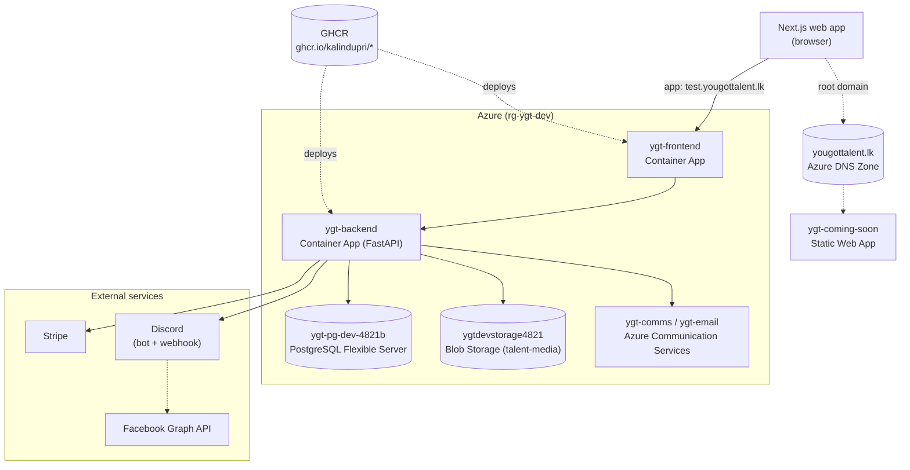

# YouGotTalent — Development & Operations Reference

Internal technical reference: architecture, Azure infrastructure, DNS, deployment, and how to
run everything manually if the usual tooling isn't available. Last verified against live Azure
state on **2026-08-09**.

For product-level docs (features, walkthroughs), see `docs/product-overview.html` and
`docs/walkthrough.html`. This document is for engineering/ops.

---

## 1. What this is

YouGotTalent is a talent marketplace for Sri Lanka's creative industry (actors, singers,
dancers, models, photographers, etc.) connecting **talent** with **recruiters** posting casting
calls, via a Next.js web app backed by a FastAPI API.

Plus a backend-only **marketing automation pipeline** (Discord-driven Facebook auto-poster) and
**error monitoring** (Discord alerts), both described in §9.

> This repo is web-only — there is no mobile app in this codebase. (If you've seen references
> to an Expo/mobile app or a separate ASP.NET API elsewhere, that's a different project — not
> part of YouGotTalent.)

---

## 2. Architecture



- **App path**: `test.yougottalent.lk` → `ygt-frontend` → `ygt-backend` → Postgres / Blob Storage / Communication Services / Stripe / Discord. Discord approval, once you react, triggers a Facebook Page post (the marketing pipeline, §9).
- **Root domain path**: `yougottalent.lk` resolves via the DNS zone to the `ygt-coming-soon` Static Web App — a separate "we're coming" landing page, not the app itself. See §8 for the full DNS breakdown.
- **Deploys**: GHCR holds both container images; Azure Container Apps pulls from there on every deploy (manual today — see §10 for the caveat on whether the CI auto-deploy actually fires).

**Backend**: FastAPI + SQLAlchemy 2.0 + Alembic, Python 3.12. JWT auth (OAuth2 password flow).
Single monolithic API under `/api/v1`, routed by feature module (`app/api/routes/*.py`).

**Frontend**: Next.js (App Router) + TypeScript + Tailwind v4.

**Database**: PostgreSQL 16. One schema, Alembic-migrated. No read replicas, no sharding —
appropriately small for current scale.

**Storage**: Azure Blob Storage for talent media (photos/video/audio auditions). Falls back to
local disk served by the backend itself if unconfigured (dev only).

**No cron/queue exists in this app.** Anything that needs to run on a schedule (billing dunning
sweep, marketing auto-poster) is a plain authenticated endpoint that an *external* scheduler
calls — currently GitHub Actions `schedule` triggers. See §9.

---

## 3. Repository layout

```
backend/            FastAPI app
  app/
    api/routes/      one file per feature area (auth, talents, recruiters, casting_calls,
                      applications, conversations, invitations, admin, bookings, calendar,
                      library, follows, reports, billing, titles, discussions, marketing)
    core/            config, security, discord/discord_bot/facebook clients, payments,
                      error_monitoring, storage, media_processing
    crud/            DB access + business logic, one module per model
    models/          SQLAlchemy models
    schemas/         Pydantic request/response models
  alembic/versions/  migrations (linear history, one head)
  tests/             pytest, one file per feature area
  Dockerfile
  entrypoint.sh       runs `alembic upgrade head` then starts uvicorn — every container
                      boot self-migrates, local and Azure alike
frontend/            Next.js app
e2e/                 Playwright end-to-end tests (run against a live stack, not mocked)
docs/                Product docs (HTML) + this file
deploy/              azure-setup.ps1 — one-time infra provisioning script (reference/history)
infra/               azure-deploy.ps1 — earlier draft of the same (superseded by deploy/)
coming-soon/         Static "we're coming" landing page source — deployed to Azure Static
                      Web Apps as ygt-coming-soon, served at the root domain
.github/workflows/
  deploy.yml          builds + pushes both images, updates both Container Apps — triggers on
                      every push to main (see §7 for a caveat on whether this is actually firing)
  marketing-cron.yml  polls the marketing pipeline endpoints every 30 min (§9)
docker-compose.yml    local dev stack: postgres + backend + frontend
.env                  local secrets (gitignored — never committed)
```

---

## 4. Running it locally

### Prerequisites
Docker Desktop running. That's it — the compose stack builds both images and runs Postgres too.

### First-time setup
1. Copy `.env.example` to `.env` (if `.env.example` doesn't exist, see §6 for the full variable
   list — only `DATABASE_URL`, `SECRET_KEY`, `CORS_ORIGINS` are required to get a working dev
   stack; everything else has safe defaults or degrades gracefully when unset).
2. From the repo root:
   ```bash
   docker compose up -d
   ```
   This starts Postgres, then the backend (which runs `alembic upgrade head` automatically on
   boot — no manual migration step needed), then the frontend.
3. Frontend: http://localhost:3001
   Backend API: http://localhost:8000/api/v1
   Interactive API docs (Swagger UI): http://localhost:8000/docs

### Common local operations
```bash
# Rebuild after changing requirements.txt or the Dockerfile (source-only changes hot-reload
# inside the container via the bind mount — but Windows has no filesystem-watch hot reload for
# the backend, so a restart is still needed after most backend edits)
docker compose build backend
docker restart yougottalent-backend-1

# Just restart to pick up a code/env change without a full rebuild
docker compose up -d --force-recreate backend

# Run the backend test suite
docker exec yougottalent-backend-1 python -m pytest -q

# Run one test file
docker exec yougottalent-backend-1 python -m pytest tests/test_marketing.py -q

# Open a Postgres shell
docker exec -it yougottalent-db-1 psql -U ygt -d ygt

# Create an admin user (no public signup path for admin role)
docker exec yougottalent-backend-1 python scripts/create_admin.py <email> <password> <full_name>
```

### Running without Docker (bare metal)
Only needed if Docker itself is unavailable.

```bash
# Backend
cd backend
python -m venv venv && source venv/bin/activate   # or venv\Scripts\activate on Windows
pip install -r requirements.txt
# Needs a reachable Postgres — either install locally or point DATABASE_URL at Azure's
alembic upgrade head
uvicorn app.main:app --reload --port 8000

# Frontend (separate terminal)
cd frontend
npm install
npm run dev   # http://localhost:3000 by default outside compose
```

`ffmpeg` must be on `PATH` for video/audio compression (`app/core/media_processing.py`) — the
Docker image installs it via apt; bare-metal needs it installed manually.

---

## 5. Testing

| Suite | Location | Run command |
|---|---|---|
| Backend unit/integration | `backend/tests/` | `docker exec yougottalent-backend-1 python -m pytest -q` |
| E2E (Playwright) | `e2e/tests/` | `npx playwright test` from `e2e/` — needs the full stack running |

As of the last full run (2026-08-09): **339 backend tests passing**. E2E suite was last
confirmed fully green earlier in the project (72 tests) but hasn't been re-run in this
session — re-run before trusting that number is still current.

E2E tests hit a live dev stack directly (not mocked) — they need `docker compose up` running
first, and some tests use raw SQL against the dev DB to set up state (e.g. forcing a
subscription active) rather than going through the UI for every precondition.

---

## 6. Environment variables

All variables are read by `backend/app/core/config.py` (Pydantic Settings, loads from `.env`
locally). **None of the actual secret values are reproduced here** — only names, purpose, and
where the real value lives. Locally: `.env` (gitignored). In Azure: Container App secrets
(`az containerapp secret list`) referenced via `secretref:` in the app's env vars.

### Core
| Variable | Purpose | Required? |
|---|---|---|
| `DATABASE_URL` | Postgres connection string (`postgresql+psycopg2://...`) | Yes |
| `SECRET_KEY` | JWT signing key | Yes — must be a real random value in any non-local env |
| `CORS_ORIGINS` | Allowed frontend origin(s), comma-separated or JSON array | Yes |
| `FRONTEND_URL` | Used to build links in outgoing emails | Recommended |
| `BACKEND_PUBLIC_URL` | Only used for the local-disk media fallback | Dev only |

### Storage
| Variable | Purpose |
|---|---|
| `AZURE_STORAGE_CONNECTION_STRING` | Blob storage for talent media. Unset → local-disk fallback (dev only) |
| `AZURE_STORAGE_CONTAINER` | Container name, default `talent-media` |

### Payments (Stripe — see `app/core/payments/`)
| Variable | Purpose |
|---|---|
| `PAYMENT_GATEWAY` | `mock` (default, no external calls) / `payhere` / `stripe` |
| `STRIPE_SECRET_KEY`, `STRIPE_PUBLISHABLE_KEY`, `STRIPE_WEBHOOK_SECRET` | Stripe API credentials |
| `STRIPE_TALENT_PRICE_ID`, `STRIPE_RECRUITER_PRICE_ID` | Pre-created recurring Price IDs |
| `STRIPE_CURRENCY` | Stripe doesn't settle LKR — separate currency from the LKR PayHere path |
| `PAYHERE_MERCHANT_ID`, `PAYHERE_MERCHANT_SECRET`, `PAYHERE_SANDBOX` | Sri Lanka payment gateway (not currently active — `PAYMENT_GATEWAY=stripe` on Azure) |

### Email
| Variable | Purpose |
|---|---|
| `AZURE_COMMUNICATION_CONNECTION_STRING` | Preferred path — Azure Communication Services Email |
| `SMTP_HOST`, `SMTP_PORT`, `SMTP_USER`, `SMTP_PASSWORD`, `SMTP_USE_TLS` | Fallback (e.g. Gmail) if ACS isn't configured |
| `EMAIL_FROM` | Sender address, default `no-reply@yougottalent.lk` |

Order of precedence: ACS → SMTP → log-only (see `app/core/config.py` comment).

### Discord / Facebook (see §9)
| Variable | Purpose |
|---|---|
| `DISCORD_WEBHOOK_URL` | User-filed content reports → this webhook. **Not currently set on Azure** — reports there fall back to log-only. Local `.env` has a real value. |
| `DISCORD_BOT_TOKEN` | Bot used for both the marketing pipeline and error alerts |
| `DISCORD_MARKETING_CHANNEL_ID` | Channel the marketing bot posts drafts to |
| `DISCORD_ERROR_CHANNEL_ID` | Channel backend crash/error alerts post to (separate from the report webhook above) |
| `FACEBOOK_PAGE_ID`, `FACEBOOK_PAGE_ACCESS_TOKEN` | Facebook Page auto-posting. The token is a long-lived **user** token with page permissions, not a Page token — `app/core/facebook.py` exchanges it for the real Page token on every call, so it never needs to be re-derived manually |
| `MARKETING_CRON_SECRET` | Auth for the two unattended marketing endpoints (`X-Cron-Secret` header) |
| `MARKETING_APPROVAL_TIMEOUT_HOURS` | Default 24 — how long a draft waits for a Discord reaction |
| `MARKETING_MIN_HOURS_BETWEEN_TOPICS` | Default 20 — rate-limits new topic requests to ~once/day even under frequent polling |

### Business rule constants (all have sane defaults, rarely need overriding)
`FREE_TIER_MEDIA_LIMIT`, `FREE_TIER_OPEN_CASTING_CALL_LIMIT`, `FREE_TIER_VIDEO_LIMIT`,
`PREMIUM_TIER_VIDEO_LIMIT`, `PREMIUM_FEATURED_SLOT_LIMIT`, `MAX_UPLOAD_SIZE_BYTES`,
`PREMIUM_TALENT_PRICE_LKR`, `PREMIUM_RECRUITER_PRICE_LKR`, `ANNUAL_BILLING_MONTHS_CHARGED`,
`TALENT_TRIAL_DAYS`, `RECRUITER_TRIAL_DAYS`, `PAST_DUE_GRACE_DAYS`,
`PAST_DUE_REMINDER_AFTER_DAYS`, `RETENTION_DISCOUNT_PERCENT`, `RETENTION_DISCOUNT_MONTHS`.

### Frontend
| Variable | Purpose |
|---|---|
| `NEXT_PUBLIC_API_URL` | Backend base URL. **Baked in at Docker build time** (Next.js `NEXT_PUBLIC_*` convention) — changing it requires a rebuild, not just a container restart/env update |

---

## 7. Azure resources (live inventory, `rg-ygt-dev`)

Subscription: `az-ygt` (`b89a1ad9-d445-4696-b509-76b29db599b1`), tenant
`b03baaef-4447-442d-ba60-d7c6628cb9a0`, region **Central US** for compute (storage account is
in **East US**). Login with `az login`, then all commands below assume
`-g rg-ygt-dev` / `--resource-group rg-ygt-dev`.

| Resource | Type | Name | Notes |
|---|---|---|---|
| Resource group | — | `rg-ygt-dev` | Everything lives here — `az group delete -n rg-ygt-dev` tears down the whole project |
| Container Apps environment | `Microsoft.App/managedEnvironments` | `ygt-env` | Shared by both apps. Default domain `icysmoke-0f0ee613.centralus.azurecontainerapps.io` |
| Backend | `Microsoft.App/containerApps` | `ygt-backend` | Image `ghcr.io/kalindupri/ygt-backend:<tag>`, port 8000, 0.5 vCPU / 1Gi, 0–2 replicas (scales to zero when idle) |
| Frontend | `Microsoft.App/containerApps` | `ygt-frontend` | Image `ghcr.io/kalindupri/ygt-frontend:<tag>`, port 3000, 0.5 vCPU / 1Gi, 0–2 replicas |
| Database | `Microsoft.DBforPostgreSQL/flexibleServers` | `ygt-pg-dev-4821b` | PostgreSQL 16, Burstable `Standard_B1ms`, 32GB storage, HA disabled, 7-day backup retention |
| Blob storage | `Microsoft.Storage/storageAccounts` | `ygtdevstorage4821` | `Standard_LRS`, container `talent-media` (public blob read — matches how the app stores plain URLs, no SAS tokens) |
| Static Web App | `Microsoft.Web/staticSites` | `ygt-coming-soon` | Serves the coming-soon landing page at the root domain (source: `coming-soon/index.html`) |
| DNS zone | `Microsoft.Network/dnszones` | `yougottalent.lk` | See §8 |
| Communication Services | `Microsoft.Communication/CommunicationServices` | `ygt-comms` | |
| Email domain | `Microsoft.Communication/EmailServices/Domains` | `ygt-email/yougottalent.lk` | Verified sending domain (DKIM/DMARC/SPF records in the zone, see §8) |
| Log Analytics workspace | `Microsoft.OperationalInsights/workspaces` | `workspace-rgygtdev7I02` | Container Apps environment logs |
| Managed certificate | `.../managedCertificates` | `mc-ygt-env-test-yougottalen-6718` | TLS cert for the `test.yougottalent.lk` custom domain binding on the frontend |

### Backend Container App secrets (names only)
```
discord-bot-token
discord-marketing-channel-id
discord-error-channel-id
facebook-page-id
facebook-page-access-token
marketing-cron-secret
ghcrio-kalindupri          (GHCR pull credential)
```
List/inspect: `az containerapp secret list -g rg-ygt-dev -n ygt-backend`

**Note**: several env vars on the live backend (`DATABASE_URL`, `AZURE_STORAGE_CONNECTION_STRING`,
`STRIPE_*`, `SMTP_*`) are currently set as **plain env vars**, not `secretref:`-backed secrets —
inherited from the original provisioning script (`deploy/azure-setup.ps1`), which only routed
the storage connection string through a secret (semicolons in the value broke shell quoting).
Worth migrating the rest to proper secrets at some point; not urgent, just noted here.

### Postgres firewall rules
```
AllowMyIP                                    <a specific developer IP>
AllowAllAzureServicesAndResourcesWithinAzureIps_...   0.0.0.0/0.0.0.0  (Azure's documented
                                                        special-case meaning "allow Azure
                                                        services", not open-to-internet)
```

---

## 8. DNS (`yougottalent.lk`, Azure DNS Zone)

Nameservers (at the registrar): `ns1-04.azure-dns.com`, `ns2-04.azure-dns.net`,
`ns3-04.azure-dns.org`, `ns4-04.azure-dns.info`.

| Record | Type | Target | Purpose |
|---|---|---|---|
| `@` (root) | A (alias) | `ygt-coming-soon` Static Web App | Root domain shows the "we're coming" landing page, **not** the main app |
| `www` | CNAME | `blue-forest-0223fda10.7.azurestaticapps.net` | Same static site |
| `test` | A (alias) + TXT | `ygt-frontend` Container App | **This is where the actual live web app is** — `https://test.yougottalent.lk` |
| `asuid.test` | TXT | — | Azure custom-domain ownership verification for the `test` binding |
| `_dmarc` | TXT | — | Email DMARC policy |
| `selector1-azurecomm-prod-net._domainkey`, `selector2-...` | CNAME | — | DKIM for Azure Communication Services email sending |
| `@` | TXT | SPF (`v=spf1 include:spf.protection.outlook.com -all`) + domain verification | |

**There is no production domain/environment configured yet.** `test.yougottalent.lk` is the
only live app instance — the "test site" referred to elsewhere in project discussions. A real
production cutover will need: a new resource group (or clear separation within this one), a
fresh production database (no seed/dummy data), and a new DNS record (likely repointing `@`
or `www` from the coming-soon site to the frontend once the product is ready to launch, or
adding a dedicated subdomain).

Backend has **no custom domain** — it's only reachable at its default
`ygt-backend.icysmoke-0f0ee613.centralus.azurecontainerapps.io` FQDN. The frontend calls it via
`NEXT_PUBLIC_API_URL`, baked in at image build time (see §6).

---

## 9. Background pipelines (no built-in cron — external schedulers required)

### Marketing auto-poster
`app/crud/marketing_post.py`, `app/core/discord_bot.py`, `app/core/facebook.py`,
`app/core/marketing_image.py`, `app/api/routes/marketing.py`.

Flow: bot asks a topic question in the Discord marketing channel (rate-limited to ~once/day) →
a human's reply is keyword-matched to one of 7 pre-written templates (deliberately **no LLM** —
a cost/complexity decision) → a branded PNG is rendered with Pillow → draft posts to Discord
with ✅/❌ reactions → a human reacts → approved drafts publish as a photo post to the
Facebook Page.

Driven by `.github/workflows/marketing-cron.yml`, which polls
`POST /api/v1/admin/marketing/generate-draft` and `POST /api/v1/admin/marketing/check-approvals`
every 30 minutes against the deployed backend, authenticated via the `MARKETING_CRON_SECRET`
GitHub Actions repo secret.

### Error monitoring
`app/core/error_monitoring.py` — a `logging.Handler` on the root logger catches any
`logger.error()`/unhandled exception app-wide, deduplicates repeats of the same error within a
5-minute cooldown, and posts to the dedicated Discord error channel via the bot (falls back to
the general report webhook if the dedicated channel isn't configured). No scheduler needed —
this fires inline as errors happen.

---

## 10. Deployment

### How images get built and where they live
GHCR (GitHub Container Registry), **not** Azure Container Registry:
- `ghcr.io/kalindupri/ygt-backend:<tag>`
- `ghcr.io/kalindupri/ygt-frontend:<tag>`

Manual tags in use follow an `azure-vNN` convention (currently up to `azure-v20` for backend).
`.github/workflows/deploy.yml` instead tags with `latest` and the commit SHA — the two schemes
have coexisted this project's history because **deploys have mostly been done manually** (see
caveat below), not exclusively through that workflow.

### Manual deploy (the verified-working path)
```bash
# 1. Build and push
docker build -t ghcr.io/kalindupri/ygt-backend:azure-vNN ./backend
docker push ghcr.io/kalindupri/ygt-backend:azure-vNN

# 2. Point the Container App at the new image
az containerapp update -g rg-ygt-dev -n ygt-backend \
  --image ghcr.io/kalindupri/ygt-backend:azure-vNN

# Same pattern for frontend, except NEXT_PUBLIC_API_URL must be a --build-arg at build time,
# not a runtime env var:
docker build --build-arg NEXT_PUBLIC_API_URL=https://ygt-backend.icysmoke-0f0ee613.centralus.azurecontainerapps.io/api/v1 \
  -t ghcr.io/kalindupri/ygt-frontend:azure-vNN ./frontend
docker push ghcr.io/kalindupri/ygt-frontend:azure-vNN
az containerapp update -g rg-ygt-dev -n ygt-frontend --image ghcr.io/kalindupri/ygt-frontend:azure-vNN
```
Migrations run automatically on container boot (`entrypoint.sh` → `alembic upgrade head`) —
no separate migration step needed for either path.

### Adding/updating a secret (never put the plaintext value in a command you'll keep in shell
history or share — use env-var indirection or the Portal)
```bash
az containerapp secret set -g rg-ygt-dev -n ygt-backend \
  --secrets some-secret-name="$SOME_LOCAL_ENV_VAR"
az containerapp update -g rg-ygt-dev -n ygt-backend \
  --set-env-vars SOME_ENV_VAR=secretref:some-secret-name
```

### CI/CD workflow (`.github/workflows/deploy.yml`)
Triggers on every push to `main` (and manual dispatch). Builds+pushes both images tagged
`latest` + `${{ github.sha }}`, then updates both Container Apps via `az containerapp update`
using OIDC federated login (no stored Azure password) — requires repo secrets
`AZURE_CLIENT_ID`, `AZURE_TENANT_ID`, `AZURE_SUBSCRIPTION_ID`.

**Caveat**: during this project's actual usage, pushes to `main` have **not** been observed to
trigger a visible redeploy — the live image tag stayed on the last manually-pushed `azure-vNN`
tag after several pushes. Either the OIDC secrets aren't configured, the workflow is failing
silently, or it simply hasn't been checked. Worth verifying in the Actions tab before relying
on it — until confirmed, treat the manual path above as the source of truth for "did this
actually deploy."

### One-time infra provisioning
`deploy/azure-setup.ps1` is the canonical (most complete) provisioning script — resource group,
budget alert, storage, Postgres, Container Apps environment, initial image build/push/deploy,
CORS lockdown. Run once per new environment (e.g. when standing up production). `infra/azure-deploy.ps1`
is an earlier, less complete draft of the same — kept for reference, not the one to run.

Not covered by either script (set up separately, ad hoc): DNS zone + custom domain binding +
managed certificate, the coming-soon Static Web App, Azure Communication Services + email
domain verification, and all of the Discord/Facebook/Stripe secrets. If standing up a fresh
environment (e.g. production), budget time for each of these as a manual step.

---

## 11. Troubleshooting

| Symptom | Likely cause / fix |
|---|---|
| `alembic upgrade head` fails with `DuplicateObject` on a Postgres enum | A migration used the same `postgresql.ENUM(...)` instance for both the explicit `.create()` call and `op.create_table()`. Fix: create a second instance with `create_type=False` for the `create_table` call. |
| A Postgres enum column rejects a value that matches the Python enum's `.value` | This app's convention (`SQLAlchemy Enum(SomeEnum)`) stores the member's `.name` (uppercase), not `.value` — check the actual DB labels with `SELECT enumlabel FROM pg_enum WHERE enumtypid = '<type>'::regtype`. |
| A test suite makes live calls to Discord/Facebook/Stripe | Check for missing `monkeypatch` coverage — local `.env` has real credentials, so any code path not explicitly mocked in a test will hit the real API. See the `_no_dedicated_error_channel_by_default` autouse fixture in `tests/test_error_monitoring.py` for the pattern. |
| Backend container has stale dependencies after editing `requirements.txt` | `docker compose build backend` (not just `--force-recreate`) — Windows Docker has no hot dependency reload. |
| Frontend env var change has no effect | `NEXT_PUBLIC_*` vars are baked in at build time — needs an image rebuild with a new `--build-arg`, not a container restart. |
| Marketing pipeline "stuck," nothing posting to Discord | Check `MARKETING_MIN_HOURS_BETWEEN_TOPICS` rate limiting (~once/day by design) and whether a prior `MarketingPost` row is stuck in `PENDING_APPROVAL`/`AWAITING_TOPIC`/`FAILED` blocking a new one — query `marketing_posts` ordered by `created_at desc`. |
| Discord bot can't read message text | "Message Content Intent" (a privileged Discord bot permission) must be manually enabled in the Discord Developer Portal — Bot settings → Privileged Gateway Intents. Without it, message `content` fields come back empty even via REST. |
| Facebook posting fails with a confusing "publish_actions deprecated" error | The configured token is a **user** token with page permissions, not an actual **Page** token — `app/core/facebook.py` already handles the exchange automatically (`_resolve_page_token`), so this shouldn't recur; if it does, the user token itself may have expired or lost its `pages_manage_posts` scope. |

---

## 12. Known gaps

- No production environment exists yet — `test.yougottalent.lk` is the only live deployment.
- `DISCORD_WEBHOOK_URL` (user-filed content reports) is not configured on the Azure backend —
  reports there currently just log instead of alerting anyone.
- `deploy.yml`'s auto-deploy-on-push has not been confirmed to actually fire (see §10).
- Several Azure env vars carry plaintext values instead of `secretref:`-backed secrets
  (inherited from initial provisioning, see §7).
- No automated approval-gated deploy pipeline (test report → Discord approval → deploy to
  test → smoke test → Discord approval → deploy to prod) — discussed but not yet built.
